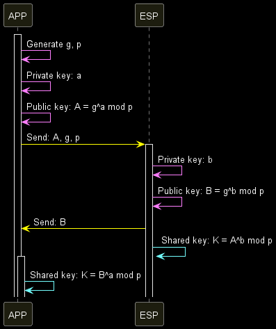

[](https://nuget.org/packages/BlufiDH) [](https://github.com/emako/BlufiDH/blob/master/LICENSE) [](https://github.com/emako/BlufiDH/actions/workflows/library.nuget.yml)

# BlufiDH

A fast Diffie-Hellman key exchange algorithm in `.NET Standard 1.1` and `.NET 6`.

## Example

```c#
internal static class Program
{
    private const string DH_P = "cf5cf5c38419a724957ff5dd323b9c45c3cdd261eb740f69aa94b8bb1a5c9640" +
            "9153bd76b24222d03274e4725a5406092e9e82e9135c643cae98132b0d95f7d6" +
            "5347c68afc1e677da90e51bbab5f5cf429c291b4ba39c6b2dc5e8c7231e46aa7" +
            "728e87664532cdf547be20c9a3fa8342be6e34371a27c06f7dc0edddd2f86373";

    private const string DH_G = "2";

    public static void Main()
    {
        const int radix = 16;
        const int dhLength = 1024;
        BigInteger dhG = BigInteger.Parse(DH_G);
        BigInteger dhP = BigIntegerParser.Parse(DH_P, radix);

        BlufiDH appDH = new(dhG, dhP, dhLength);
        BlufiDH espDH = new(dhG, dhP, dhLength);

        BigInteger A = appDH.GetPublicKey();
        BigInteger B = espDH.GetPublicKey();

        BigInteger keyA = appDH.GenerateSecretKey(B);
        Console.WriteLine($"APP computed key: {keyA}");

        BigInteger keyB = espDH.GenerateSecretKey(A);
        Console.WriteLine($"ESP computed key: {keyB}");

        if (keyA == keyB)
        {
            Console.WriteLine("Key exchange successful! Both parties have the same shared key.");
        }
        else
        {
            Console.WriteLine("Key exchange failed! The keys do not match.");
        }
    }
}
```

## DH Negotiate Security

```startuml
@startuml DH Negotiate Security

participant APP as a
participant ESP as b

activate a

a -[#Green]> a: Generate g, p
a -[#Green]> a: Private key: a
a -[#Green]> a: Public key: A = g^a mod p
a -[#Blue]> b: Send: A, g, p

activate b

b -[#Green]> b: Private key: b
b -[#Green]> b: Public key: B = g^b mod p
b -[#Blue]> a: Send: B
b -[#DarkRed]> b: Shared key: K = A^b mod p

activate a

a -[#DarkRed]> a: Shared key: K = B^a mod p

@enduml
```


